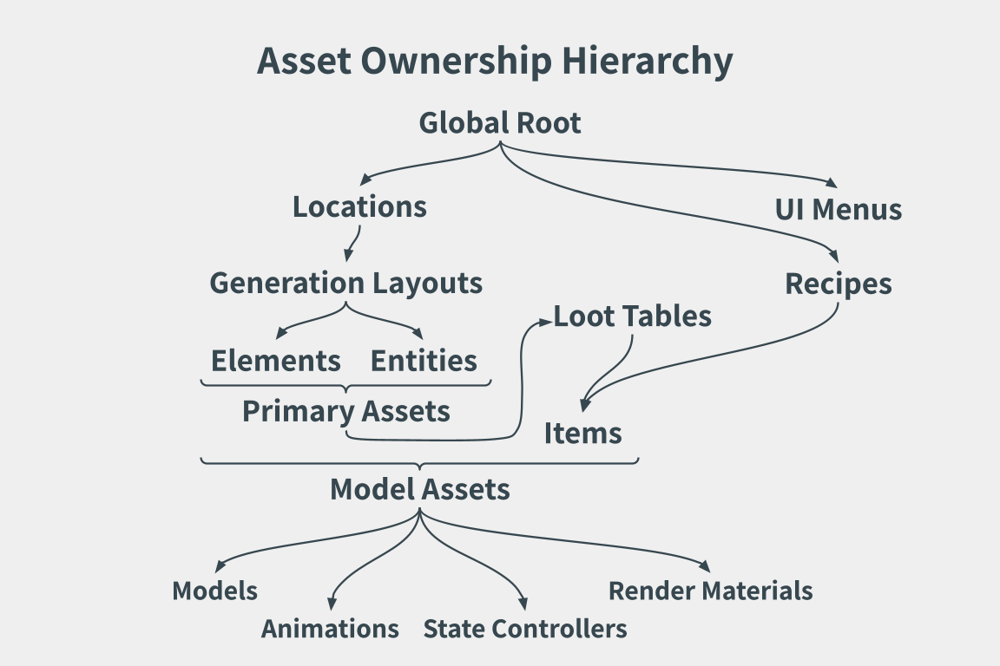

# Transcend Ruins Game Framework

#### Status: Active development

#### Language: Java (Maven framework)

#### Focus: Custom 3D game engine, UI rendering system, asset pipeline, and data-driven design

## Overview

Transcend Ruins is a custom-built Java game framework designed to explore rendering, data-driven systems, and modular engine architecture. Rather than relying solely on off-the-shelf engines, this project emphasizes understanding and implementing core subsystems – including rendering, UI composition, asset management, and schema-based content definition.

The project serves multiple purposes:

- A playable game and interactive simulation
- A sandbox for experimenting with rendering and platform design
- A long-term platform for extensibility (mods, assets, procedural generation)

While visual output is an important component, equal emphasis is placed on code structure, system boundaries, and engine-level abstractions.

## Core Design Philosophy

1. #### Data-Driven Everything

Game content is defined primarily through JSON-based schemas rather than hardcoded logic. This allows:

- Rapid iteration without recompilation
- Clear separation between platform code and content
- Dynamic recomposition of entities, UI, and assets

JSON files define what exists; Java code defines how it behaves.

2. #### Separation of Schema vs Instance

The platform differentiates between:

- Schemas – Static definitions loaded from asset files
- Presets – Parameterization for specific asset file eferences
- Contexts – Pre-instantiation runtime argument contextualization
- Instances – Runtime objects that exist in the world

This distinction allows attributes to be layered, overridden, applied, and removed without destroying the underlying definition.

## Asset System

Asset vs Instance

An Asset represents a definition loaded from disk (JSON, textures, language files, models). An Instance represents that asset instantiated in the game world or UI.

Assets include:

- Elements
- Entities
- Items
- Models
- Render Materials
- State Controllers
- Animations
- Recipes
- Loot Tables
- UI layouts (interfaces)
- Generation layouts (layouts)

Asset instances contain:

- Runtime state
- References to assets
- Applied attributes

This distinction enables:

- Multiple instances of the same asset
- Dynamic modification without mutating definitions

### Example element JSON definition:

### `transcendRuins.contentPack/element/pineDoor.json`

```
{
    "metadata": {
        "identifier": "Transcendruins:pineDoor"
    },
    "attributes": {
        "texture": "pineDoor",
        "model": "TranscendRuins:basicDoor",
        "renderMaterial": "TranscendRuins:opaqueMattCulling"

        "stateController": "TranscendRuins:basicDoor",

        "loot": "TranscendRuins:pineDoor"
    },
    "permutations": {
        "modified": { ... }
    },
    "events": { ... }
}
```



## Rendering Architecture

### 3D Rendering

The platform integrates jMonkeyEngine (jME) for 3D rendering, scene management, and low-level graphics operations. Rather than using jME as a full game engine, it is treated as a rendering backend.

Key responsibilities handled by jME:

- Mesh rendering
- Camera projection
- GPU buffer management
- Scene graph traversal

Key responsibilities handled by Transcend Ruins:

- World layout generation
- Asset definitions and inter-asset reference validation
- Runtime asset logic
- UI composition

### Custom UI Rendering Engine

One of the most distinctive parts of the project is the custom UI renderer, implemented independently of jME’s built-in GUI system.

Component-Based UI Model

UI elements are composed of components, including:

- Menus
- Lists / containers
- Buttons
- Images
- Text

Each component:

- Participates in layout
- Accepts style rules
- Can inherit properties from parent containers

Unlike traditional immediate-mode UIs, this system is retained-mode and hierarchical.

### Styling & Selector System

The UI engine supports CSS-inspired selectors, including:

- Type selectors (e.g., panel, button)
- Class selectors
- ID selectors
- Parent/Siblings Descendant selectors (e.g., ~, &gt;)

Style rules are resolved by:

1. Selector matching
2. Property inheritance
3. Component capability checks

This allows expressive styling while preventing invalid property application (e.g., positioning applied to inline text nodes).

### Example UI Style Definition:

### `transcendRuins.contentPack/style.json`

```
{

    "panel > button": {
        "background": "#AAAAAA"
    },
    "#inventoryExitButton": {
        "origin": ["100%", "0%"],
        "x": "100%",
        "y": "0%",
        "border": {
            "style": "solid",
            "color": "#882200",
            "width": "2px"
        }
    }
}
```

## World & Layout Generation

World content is generated through layout generation definitions rather than fixed maps.

Layouts:

- Are grid-based
- Can host multiple elements or entities per tile
- Support dependency resolution between elements

This enables procedural yet structured generation, particularly useful for cities, districts, and interiors.

### Example layout JSON definition:

### `transcendRuins.contentPack/layout/campfireCircle.json`

```
{
  "metadata": {
    "identifier": "TranscendRuns:campfireCircle"
  },
  "attributes": {
    "width": 40,
    "length": 40,
    "type": "distributed",
    "iterationType": "sequential",
    "components": [
      {
        "component": {
          "type": "element", "element": "TranscendRuns:campfire",
          "tag": "campfire",
          "placement": {
            "center": {
              "type": "center"
            }
          }
        }
      },
      {
        "component": {
          "type": "element", "element": "TranscendRuns:rock",
          "placement": {
            "distribution": {
              "type": "ring", "radius": 5,
              "spread": 0.5
            },
            "shape": {
              "type": "circle", "radius": 10
            },
            "center": {
              "type": "tag",
              "tag": "campfire"
            }
          },
          "count": 25
        }
      },
      {
        "component": {
          "type": "element", "element": "TranscendRuns:torch",
          "placement": {
            "distribution": {
              "type": "ring", "radius": 12,
              "spread": 0.4
            },
            "shape": {
              "type": "circle", "radius": 18
            },
            "center": {
              "type": "tag",
              "tag": "campfire"
            }
          },
          "count": 25
        }
      }
    ]
  }
}
```

## Resource Management

Resources allow safe styling modifications without altering gameplay behaviors. Where content packs may be restricted to prevent altering gameplay functionality, resource packs can be freely added, modified, or removed at the player's discretion.

Resources are grouped into resource sets, such as:

- Textures
- Sounds
- Language files
- UI styles

## Exception & Error Reporting System

The engine includes a custom exception logging system designed for clarity and debuggability. The goal is not just to report failure, but to explain why the engine cannot safely proceed.

Features include:

- Structured error objects
- Context-aware logging
- Side-by-side visualization of input JSON and resulting error output

Exceptions are not treated as opaque stack traces, but as engine-level events with meaningful context.

This system is used heavily during:

- Asset loading
- Schema validation
- UI parsing

Logged exception types include:

- File:

  - Missing Path
  - File Format

- Reference:

  - Missing Property
  - Reference Without Definition
  - Property Type
  - Key Name
  - Unexpected Value

- Identifier:

  - Duplicate Identifier
  - Identifier Format
  - Version Bounds Exception

- Dependency:

  - Ambiguous Dependency
  - Unresolved Dependency
  - Duplicate Dependency
  - Version Hierarchy

- Miscellaneous:

  - Collection Size
  - Number Bounds

Exception logs are output in the `Transcend Ruins Library` folder that is automatically created upon downloading _Transcend Ruins_.

### Example exception log:

### `Transcend Ruins Library/logs/Log 01-01-2026.log`

```
----------------------------------------
         Log 12:34:56
----------------------------------------

[Property Exception -> Model Reference Without Definition Exception] >>> assets/packs/content/vanilla [1, 0, 0].contentpack/element/crate.json | JSON parsing exception at field [attributes, model] : Model TranscendRuins:cube is referenced but cannot be traced.


[Property Exception -> Missing Property Exception] >>> assets/packs/content/vanilla [1, 0, 0].contentpack/entity/player.json | JSON parsing exception at field [attributes -> texture] : Property "texture" is undefined.
```

## Development Goals

Short-term:

- Finalize JSON schema format specifications
- Develop asset types for user gameplay
- Integrate animations into jMonkeyEngine animation system
- Improve documentation

Long-term:

- Mod support
- Server-based simulation
- Improved rendering pipeline
- Expanded animation and interaction systems

## Repository Structure (Planned)

### Project Code Structure

```
transcendruins/
 ├─ README.md
 ├─ LICENSE
 ├─ pom.xml
 ├─ .lwjgl/
 │   └─ ...
 │
 ├─ src/main
 │   ├─ java/com/transcendruins/
 │   │   ├─ App.java
 │   │   ├─ utilities/
 │   │   │   └─ ... # exceptions, file handling, immutable collections, json parsing, metadata, random, selection methods, sound
 │   │   │
 │   │   ├─ rendering/
 │   │   │   └─ ... # RenderInstance, RenderPacket, render buffers
 │   │   │
 │   │   ├─ world/
 │   │   │   └─ ... # World, Player, PlayerSpawn, AreaGrid, AreaTile, interaction calls
 │   │   │
 │   │   ├─ packs/
 │   │   │   └─ ... # Pack, PackProcessor, content packs, resource packs
 │   │   │
 │   │   ├─ resources/
 │   │   │   └─ ... # ResourceSet, textures, sounds, languages, styles
 │   │   │
 │   │   └─ assets/
 │   │       └─ ... # Instance, Attributes, AssetType, AssetEvent, all asset categories, asset catalogue
 │   │
 │   └─ resources/
 │       └─ ...

```

---

### Internal/External Libraries

```
resources/assets/
 ├─ packs/
 │   ├─ content/
 │   │   └─ [built-in content pack].contentpack/
 │   │       └─ ...
 │   │
 │   └─ resources/
 │       └─ [built-in resource pack].resourcepack/
 │           └─ ...
 │
 ├─ data/
 │   └─ ...


Transcend Ruins Library/
 ├─ packs/
 │   ├─ content/
 │   │   └─ [user content pack].contentpack/
 │   │       └─ ...
 │   │
 │   └─ resources/
 │       └─ [user resource pack].resourcepack/
 │           └─ ...
 │
 ├─ logs/
 │   └─ [example log file].log
```

---

### Content Pack Structure

```
[example content pack].contentpack/
 ├─ manifest.json
 ├─ packIcon.png
 ├─ global.json
 ├─ style.json
 ├─ hud.json
 ├─ recipe.json
 ├─ texture/
 │   ├─ texture.json
 │   └─ [example image].png
 │
 ├─ sound/
 │   ├─ sound.json
 │   └─ [example audio].wav
 │
 ├─ language/
 │   └─ [example language].json
 │
 ├─ [all asset types]/
 │   └─ [example asset].json
```

## Conclusion

Transcend Ruins is not just a game – it is an ongoing exploration of engine architecture, rendering systems, and data-driven design. Every subsystem is designed to be understandable, extensible, and testable, with a strong emphasis on why systems are built and future maintainability, not just that they work.

This README will evolve alongside the project as systems stabilize and new features are introduced.
